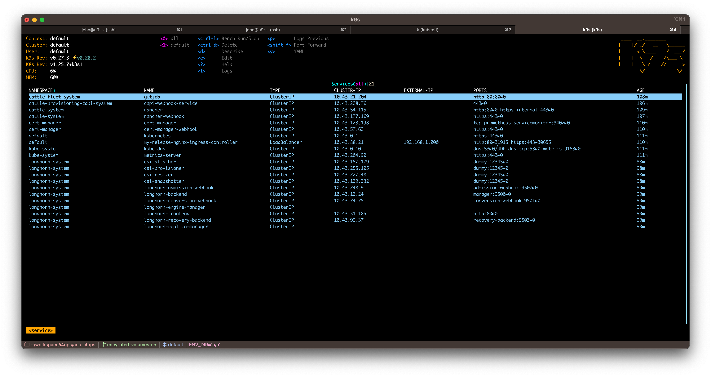
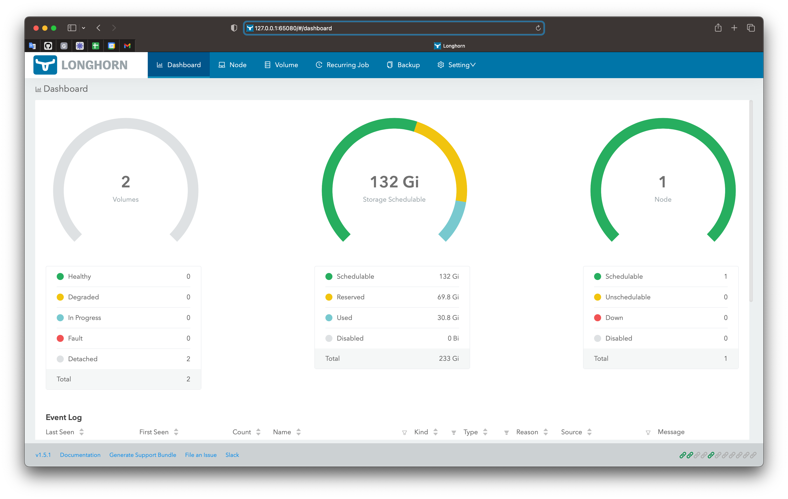

# Overview
To enhance productivity, it is highly convenient to manage Kubernetes clusters directly from your local host, where you have all the necessary tools (such as k9s and lens) for monitoring, along with a web browser to access diverse dashboards.

# Setting up kubectl access

The ansible playbook, while creating a kubernetes cluster, generates artifacts in the `artifacts/` directory. In this chapter we will use them in order to establish connection with the kube-api from the master node.

**Note:** you can re-create the artifacts by running the ansible-playbook command with the `--tags='artifacts'` argument.

Use kube config that has been fetched from the master node:
```
export KUBECONFIG=artifacts/k0s-kubeconfig.yaml
```
You should have the kubectl access now. Let's test it:
```
kubectl get nodes
```
You should see list of nodes from your cluster.

# Using k9s
Prerequisites: [kubectl access](#setting-up-kubectl-access)

K9s is a terminal based UI to interact with your Kubernetes clusters

Run k9s on your local host:
```
k9s
```


# Accessing Longhorn dashboard

Prerequisites: [kubectl access](#setting-up-kubectl-access)

Make `longhorn-frontend` service available in your host at port `65080`
```
kubectl port-forward svc/longhorn-frontend -n longhorn-system 65080:80
```
Open web browser and access the Longhorn dashboard via the `http://127.0.0.1:65080` URL.


# Troubleshooting

**Problem**
After running `bash artifacts/latest/bin/ssh-tunnel.sh`, I obtain the following error:
```
bind [127.0.0.1]:6443: Address already in use
channel_setup_fwd_listener_tcpip: cannot listen to port: 6443
Could not request local forwarding.
```

**Solution:**
Most probably you have already started that script. Check if there are any processes that are running ssh command with the 6443 port:
```
ps aux | grep 6443
```
If so, kill those processes and run the script again.