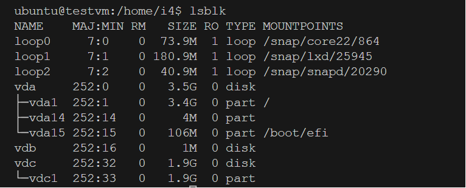

# Longhorn Ansible Playbook 

**IMPORTANT NOTE: add the label "volume: longhorn to any kubernetes object(deloyment, pods, or statefulsets) that will consume the longhorn storage or volume** 

**This playbook assumes that [kubevirt](../kubevirt) has been deployed into the cluster**

## Files and Directories
- **roles:** contains two roles, install (which has the tasks that installs longhorn) and delete (deletes longhorn)
- **hosts.ini:** host file to specify hosts ip and user
- **install-playbook.yaml:** playbook to install longhorn
- **delete-playbook.yaml:** deletes longhorn 
## Steps
- modify the hosts.ini file to contain the server's ip and username
- add your ssh key to the remote using 
```ShellSession
ssh-copy-id -i <path/to/public/key> hostname@remote-server-ip
```
**NOTE:** make sure that hostkey-checking is disabled in the default section of your /etc/ansible/ansible.cfg file.

- run the playbook using 
```ShellSession
ansible-playbook -i hosts.ini -k -K install-playbook.yaml
``` 
- once the playbook runs, cd into the longhorn directory and create a storage class and persistent volume claim 
```ShellSession
kubectl apply -f longhorn-vm-pvc.yaml
``` 
- cd into user's home directory and create a vm.
```ShellSession
cd ~
kubectl apply -f vm.yaml
```  
- start the vm.
```ShellSession
virtctl start testvm
```
- watch the status of the vm using `kubectl get vmi -w` and wait for the `running` status. connect to the vm using 
```ShellSession
virtctl console testvm
```
## Partition Longhorn Storage in Kubevirt vm
**It is assumed that there's a running instance of kubevirt vm within the cluster**
- Console into the running vmi `virtctl console <name-of-vmi>`
- Log in with username and password
- List block storage `lsblk` (*on kubevirt, the storage maybe named vdc*)

- partition disk `sudo fdisk /dev/vdc` 
* This will start up a prompt, type 'n' for new partition.
 
* Follow to prompt

* Type 'p' for primary partition


* Click enter to select the default partition, default first sector and default last sector.

* Type 't' to change the partition type
* Type '8e' to select the linux lvm
* Type 'w' to write and exit the prompt

* View the newly created partition `lsblk`

  
- Make filesystem with `sudo mkfs.ext4 /dev/vdc1`
- Make the i4 directory `sudo mkdir /i4`
- Mount the partitioned volume `sudo mount /dev/vdc1 i4`
- Touch .i4 file `sudo touch /i4/.i4` (*if you get an 'access/permission denied' output, check the file permissions on /i4 and make sure you have a write perssion. You can modify that using `sudo chmod +x /i4`*)
- Copy the i4ctl bin into user's local bin `sudo cp /home/i4/i4ctl /usr/local/bin`
- Run the i4ctl mount `i4ctl -m /i4/.i4`

## Resources
- [Longhorn](https://longhorn.io/docs/1.5.1/what-is-longhorn/)
- [Installation](https://longhorn.io/docs/1.5.1/deploy/install/)
- [Use Longhorn](https://longhorn.io/docs/1.5.1/volumes-and-nodes/create-volumes/)